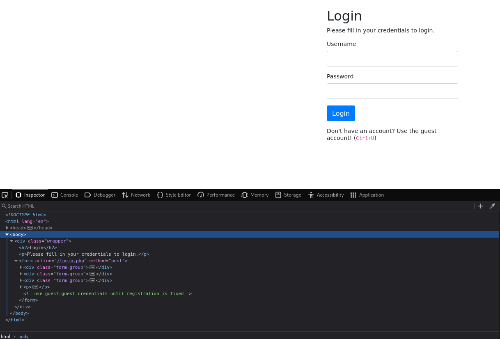
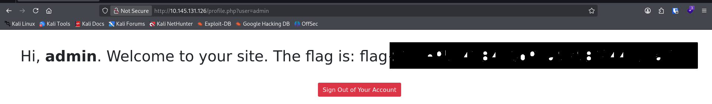

# TryHackMe: Neighbour — IDOR Writeup

**Autor:** Alexis
**Fecha:** Julio 2026
**Dificultad:** Easy
**Categoría:** Broken Access Control / IDOR

## Resumen Ejecutivo
El room "Neighbour" presenta un IDOR (Insecure Direct Object Reference) 
en el endpoint `profile.php`. La aplicación no valida del lado del servidor 
si el usuario autenticado tiene permiso de acceder al recurso solicitado, 
permitiendo ver datos de cualquier perfil con solo modificar un parámetro 
de la URL.

## Metodología
Basado en OWASP WSTG (WSTG-ATHZ-04: Testing for Insecure Direct Object References).

## 1. Reconocimiento
Acceso directo vía navegador al login de la aplicación web (sin escaneo 
de puertos requerido para este vector — el objetivo era el servicio web 
en el puerto 80).

## 2. Identificación de la vulnerabilidad
Al inspeccionar el código fuente de la página de login (DevTools → Inspector), 
se encontró un comentario HTML expuesto:



```html
<!--use guest:guest credentials until registration is fixed-->
```

**Hallazgo secundario:** exposición de credenciales en comentarios de 
código fuente (Information Disclosure).

## 3. Explotación
1. Login con las credenciales `guest:guest`
2. La URL resultante muestra: `profile.php?user=guest`
3. Al modificar manualmente el parámetro a `profile.php?user=admin`, 
   la aplicación devuelve el perfil del administrador sin ninguna 
   validación de autorización adicional



*Nota: la flag ha sido ocultada de la captura en cumplimiento con los 
términos de servicio de TryHackMe.*

## 4. Impacto (CVSS 3.1)
**Vector:** `CVSS:3.1/AV:N/AC:L/PR:L/UI:N/S:U/C:H/I:N/A:N`
**Score:** 6.4 (Medium)

| Métrica | Valor | Justificación |
|---|---|---|
| AV | Network | Explotable remotamente vía HTTP |
| AC | Low | No requiere condiciones especiales |
| PR | Low | Requiere autenticación (aunque sea guest) |
| UI | None | No requiere interacción de terceros |
| C | High | Acceso a datos de cualquier usuario del sistema |
| I | None | Solo lectura, sin modificación de datos |
| A | None | Sin impacto en disponibilidad |

## 5. Remediación
- Implementar validación de autorización server-side: verificar que el 
  `user_id` de la sesión activa coincida con el recurso solicitado antes 
  de devolver cualquier dato
- Usar identificadores indirectos (UUIDs no predecibles) en lugar de 
  nombres de usuario o IDs secuenciales en la URL
- Eliminar credenciales y comentarios sensibles del código fuente antes 
  de pasar a producción

## Lecciones Aprendidas
IDOR sigue siendo una de las vulnerabilidades más comunes y de mejor 
relación esfuerzo/impacto en programas de bug bounty, precisamente 
porque no requiere herramientas sofisticadas — solo atención al detalle 
en cómo la aplicación maneja la autorización de recursos.

## Referencias
- [OWASP WSTG - Testing for IDOR](https://owasp.org/www-project-web-security-testing-guide/)
- [CVSS 3.1 Calculator](https://www.first.org/cvss/calculator/3.1)
